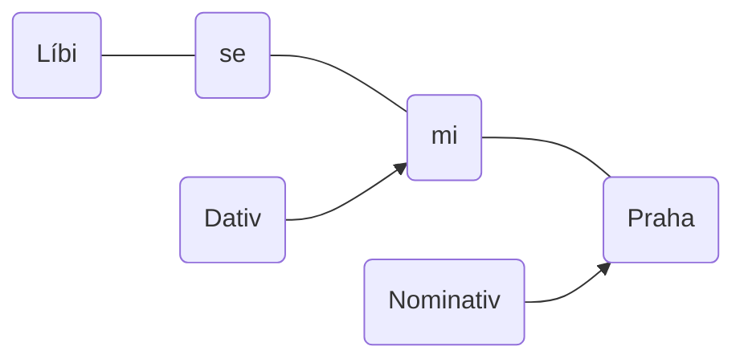

---
tags:
  - czech
  - education
---

---

# Начальная форма

| Русский      | Чешский      | být (быть) | nebýt (небыть) |
| ------------ | ------------ | ---------- | -------------- |
| Я            | Já           | Jsem       | Nejsem         |
| Ты           | Ty           | Jsi        | Nejsi          |
| Он, она, оно | On, ona, ono | Je         | Není           |
| Мы           | My           | Jsme       | Nejsme         |
| Вы           | Vy           | Jste       | Nejste         |
| Они          | Oni          | Jsou       | Nejsou         |

Není z USA. - Он не из США
Jsem v Praze. - Я в Праге.

---

# Склонение по падежам

| Падеж      | Я   | Ты  | Он, оно | Она | Мы  | Вы  | Они  |
| ---------- | --- | --- | ------- | --- | --- | --- | ---- |
| Nominative | Já  | Ty  | On, ono | Ona | My  | Vy  | Oni  |
| Genetive   | Mě  | Tě  | Ho      | Jí  | Nás | Vás | Jich |
| Dative     | Mi  | Ti  | Mu      | Jí  | Nám | Vám | Jim  |
| Akuzative  | Mě  | Tě  | Ho      | Ji  | Nás | Vás | Je   |

Líbí se mi Praha.
Líbí se mu Praha.
Nelíbí se jim ta kavárna. 

---

# После предлогов

| Падеж        | Пример контекста | Я    | Ты    | Он, оно   | Она | Мы   | Вы   | Они  |
| ------------ | ---------------- | ---- | ----- | --------- | --- | ---- | ---- | ---- |
| Nominative   |                  | Já   | Ty    | On, ono   | Ona | My   | Vy   | Oni  |
| Genetive     | Čekal u          | Mě   | Tebe  | Něho, něj | Ní  | Nás  | Vás  | Nich |
| Dative       | Šel k, ke        | Mně  | Tobě  | Němu      | Ní  | Nám  | Vám  | Nim  |
| Akuzative    | Koupil dárek pro | Mě   | Tebe  | Něho, něj | Ni  | Nás  | Vás  | Ně   |
| Lokative     | Mluvil o         | Mně  | Tobě  | Něm       | Ní  | Nás  | Vás  | Nich |
| Instrumental | Sešel se s, se   | Mnou | Tebou | Ním       | Ní  | Námi | Vámi | Nimi |

---

# Принадлежности

|     | Maskulinum (M) | Feminium (F) | Neutrum (N) |
| --- | -------------- | ------------ | ----------- |
| já  | můj            | moje         | moje        |
| ty  | tvůj           | tvoje        | tvoje       |
| on  | jeho           | jeho         | jeho        |
| ona | její           | její         | její        |
| my  | nás            | naše         | naše        |
| vy  | vás            | vaše         | vaše        |
| oni | jejich         | jejich       | jejich      |
